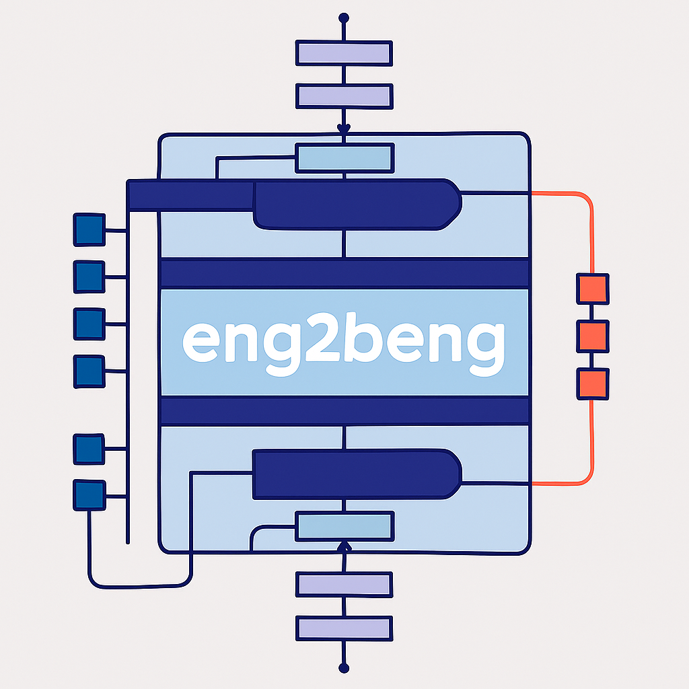

# eng2beng
A Simple Tiny English to Bengali Machine Translation Model with Transformer Architecture
Blogpost: [https://sohambhattacharyya.github.io/blog/eng2beng-A-Simple-Tiny-English-to-Bengali-Machine-Translation-Model-with-Transformer-Architecture-from-Scratch](https://sohambhattacharyya.github.io/blog/eng2beng-A-Simple-Tiny-English-to-Bengali-Machine-Translation-Model-with-Transformer-Architecture-from-Scratch)

